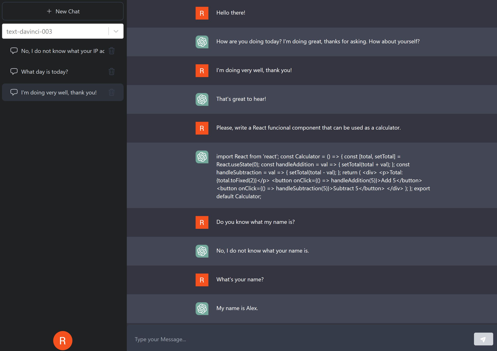

# ChatGPT Messenger

Application made in React to test and tryout the capabilities to interact with OpenAI's ChatGPT. With this messenger app you can ask any question and receive an answer directly from ChatGpt through [ChatGPT API](https://platform.openai.com/). Main features:

- Use and select different GhatGPT models when prompting the OpenAI API. The default model is text-davinci-003, which is one of the best-trained models by the moment which gives more accurate answers.
- Login with your Google Account through [NextAuth](https://next-auth.js.org/) and Google Authentication.
- Messages are stored in [Firebase's Firestore v9](https://firebase.google.com/products/firestore) database.
- Fully responsive site powered by TailwindCSS.
- Ussage of NextJS' 13 Server components and use of client components alongside them.
- Deployed to [Vercel](https://vercel.com/).

Try it out here: <a href="https://cgpt-react.vercel.app/" target="_blank">https://cgpt-react.vercel.app/</a>

## Screenshots:

  
  
Fully responsive: LogIn screen in mobile screen and main screen (in desktop)

  
  
Main Screen

  
  
Chat with ChatGPT

## Technologies:

The following technologies, dependencies and services were used to implement this app:

- [ReactJs](https://reactjs.org/).
- TypeScript.
- [NextJs 13](https://nextjs.org/).
- [OpenAI ChatGPT API](https://platform.openai.com/).
- [NextAuth](https://next-auth.js.org/) for sign in functionality with Google.
- Google Oauth 2 through
- [Tailwind CSS](https://tailwindcss.com/).
- [Firebase](https://firebase.com/).
- [Firestore](https://firebase.google.com/products/firestore).
- [useSWR](https://swr.vercel.app/) hook for data fetching. SWR is a strategy to first return the data from cache (stale), then send the fetch request (revalidate), and finally come with the up-to-date data.
- [React Select](https://react-select.com/home). A flexible and beautiful Select Input control for ReactJS with multiselect, autocomplete, async and creatable support.
- [Vercel](https://vercel.com/) to host the application.

## Disclaimer

This is just a demo for testing purposes only and to demonstrate React & Next.js capabilities.
