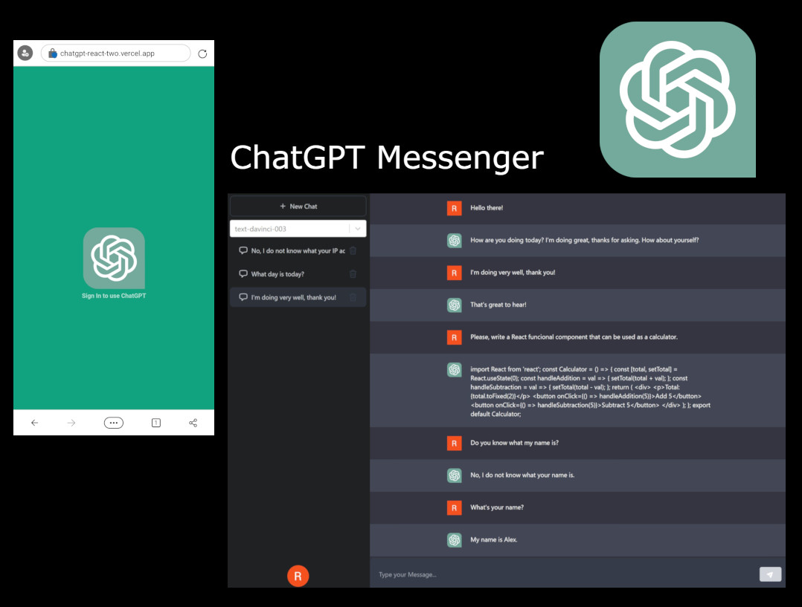
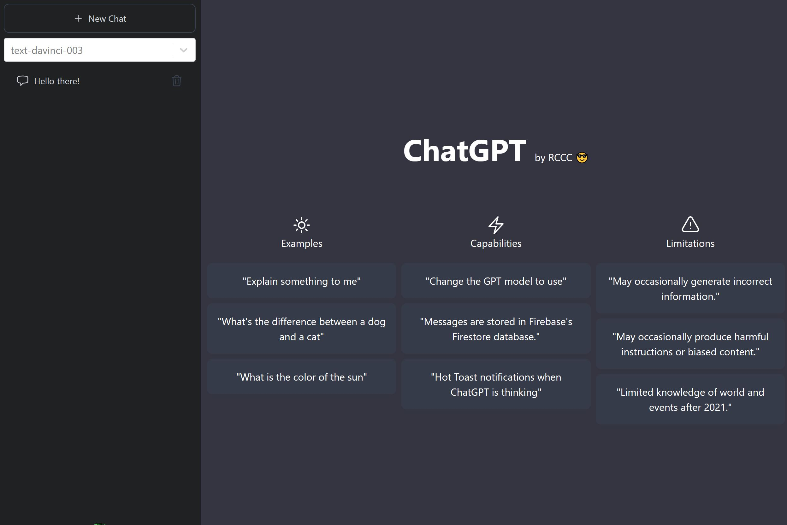

# ChatGPT Messenger

Application made in React to test and tryout the capabilities to interact with OpenAI's ChatGPT. With this messenger app you can ask any question and receive an answer directly from ChatGpt through [ChatGPT API](https://platform.openai.com/). Main features:

- Use and select different GhatGPT models when prompting the OpenAI API.
- Login with your Google Account through [NextAuth](https://next-auth.js.org/) and Google Authentication.
- Connect [Firebase v9 Firestore](https://firebase.google.com/products/firestore) database to save the chats and keep a history of conversations with ChatGPT.
- Fully responsive site powered by TailwindCSS.
- Ussage of NextJS' 13 Server components and use of client components alongside them.
- Deployed to [Vercel](https://vercel.com/).

## Screenshots:

  

  
  
Main Screen

  
  
Chat Example

## Technologies:

The following technologies, dependencies and services were used to implement this app:

- [ReactJs](https://reactjs.org/).
- TypeScript.
- [NextJs 13](https://nextjs.org/).
- [OpenAI ChatGPT API](https://platform.openai.com/).
- [NextAuth](https://next-auth.js.org/) for sign in functionality with Google.
- Google Oauth 2 through
- [Tailwind CSS](https://tailwindcss.com/).
- [Firebase](https://firebase.com/).
- [Firestore](https://firebase.google.com/products/firestore).
- [Vercel](https://vercel.com/) to host the application.

## Disclaimer

This is just a demo for testing purposes only and to demonstrate React & Next.js capabilities.
